# ConfiguraTiles Documentation

Welcome to the ConfiguraTiles documentation! This package provides a configurable tile system for your Flutter applications. It supports various features including custom app bars, floating action buttons (FAB), and debug modes.

## Table of Contents

- [ConfiguraTiles Documentation](#configuratiles-documentation)
  - [Table of Contents](#table-of-contents)
  - [Installation](#installation)
  - [Usage](#usage)
  - [Tile Configuration](#tile-configuration)
  - [App Bar Configuration](#app-bar-configuration)
  - [Floating Action Button Configuration](#floating-action-button-configuration)
  - [Debug Modes](#debug-modes)
  - [Project Links and Social Media](#project-links-and-social-media)
    - [Project Links](#project-links)
    - [Social Media](#social-media)

## Installation

Add the following to your `pubspec.yaml`:

```yaml
dependencies:
  configura_tiles: latest_version
```

Run `flutter pub get` to install the package.

## Usage

To get started with ConfiguraTiles, you need to use the `ConfiguraTileForge` widget. Here's a basic example:

```dart
import 'package:flutter/material.dart';
import 'package:configura_tiles/configura_tiles.dart';
import 'appbar/appbar_demo.dart';
import 'theme/theme_demo.dart';
import 'tile_header/tile_header.dart';
import 'visibility/visibility_demo.dart';

class TilesDemo extends StatefulWidget {
  const TilesDemo({Key? key}) : super(key: key);

  @override
  State<TilesDemo> createState() => _TilesDemoState();
}

class _TilesDemoState extends State<TilesDemo> {
  @override
  Widget build(BuildContext context) {
    return ConfiguraTileForge(
      appBarConfig: ConfiguraAppBar(
        enabled: true,
        title: 'ConfiguraTile Demo',
        titleColor: Colors.white,
        backgroundColor: Colors.black,
        leadingIcon: Icons.menu,
        leadingColor: Colors.white,
        onLeadingTap: () {
          // Add logic for leading icon tap
        },
        trailingIconEnabled: true,
        trailingIcon: Icons.help,
        trailingIconColor: Colors.white,
        onTrailingTap: () {
          // Add logic for trailing icon tap
        },
      ),
      tiles: [
        ConfiguraTile(
          tileColor: Colors.black,
          leading: const Icon(Icons.visibility, color: Colors.white),
          title: 'Visibility demo',
          subtitle: 'Turn tile on/off',
          onTap: () {
            Navigator.push(
              context,
              MaterialPageRoute(
                builder: (context) => const VisibilityDemo(),
              ),
            );
          },
          iconColor: Colors.white,
          titleColor: Colors.white,
          subtitleColor: Colors.grey[300],
          trailing: const Icon(
            Icons.arrow_forward,
          ),
          trailingColor: Colors.white,
          visibilityEnabled: false,
          visibilityCondition: () => true, 
        ),
        ConfiguraTile(
          tileColor: Colors.black,
          leading: const Icon(Icons.text_fields, color: Colors.white),
          title: 'Header-text demo',
          subtitle: 'View header text',
          onTap: () {
            Navigator.push(
              context,
              MaterialPageRoute(
                builder: (context) => const TileHeaderDemo(),
              ),
            );
          },
          iconColor: Colors.white,
          titleColor: Colors.white,
          subtitleColor: Colors.grey[300],
          trailing: const Icon(
            Icons.arrow_forward,
          ),
          trailingColor: Colors.white,

          //headerText: 'Header Text',
          headerTextColor: Colors.black, // Set the header text color
          headerSpacing: 10.0,
          textAlignment: CrossAxisAlignment.start,
          visibilityEnabled: false,
          visibilityCondition: () => true, // Define your condition here
        ),
        ConfiguraTile(
          tileColor: Colors.black,
          leading: const Icon(Icons.settings, color: Colors.white),
          title: 'Appbar demo',
          subtitle: 'Toggle appbar configs',
          onTap: () {
            Navigator.push(
              context,
              MaterialPageRoute(
                builder: (context) => const AppbarDemo(),
              ),
            );
          },
          iconColor: Colors.white,
          titleColor: Colors.white,
          subtitleColor: Colors.grey[300],
          trailing: const Icon(
            Icons.arrow_forward,
          ),
          trailingColor: Colors.white,

          visibilityEnabled: false,
          visibilityCondition: () => true, // Define your condition here
        ),
        ConfiguraTile(
          tileColor: Colors.black,
          leading: const Icon(Icons.dark_mode, color: Colors.white),
          title: 'Tile-theme demo',
          subtitle: 'Tile theme change demo',
          onTap: () {
            Navigator.push(
              context,
              MaterialPageRoute(
                builder: (context) => const ThemeDemo(),
              ),
            );
          },
          iconColor: Colors.white,
          titleColor: Colors.white,
          subtitleColor: Colors.grey[300],
          trailing: const Icon(
            Icons.arrow_forward,
          ),
          trailingColor: Colors.white,

          visibilityEnabled: false,
          visibilityCondition: () => true, // Define your condition here
        ),
      ],
      debugMode: DebugMode.userFriendly,
      customErrorMessage: 'Oops! Something went wrong.',
      fabConfig: ConfiguraFab(
        visibility: true,
        color: Colors.black,
        icon: Icons.home,
        iconColor: Colors.white,
        onFabTap: () {
          // Add logic for FAB tap
        },
        snackbarColor: Colors.red,
        snackbarTextColor: Colors.white,
      ),
    );
  }
}

```

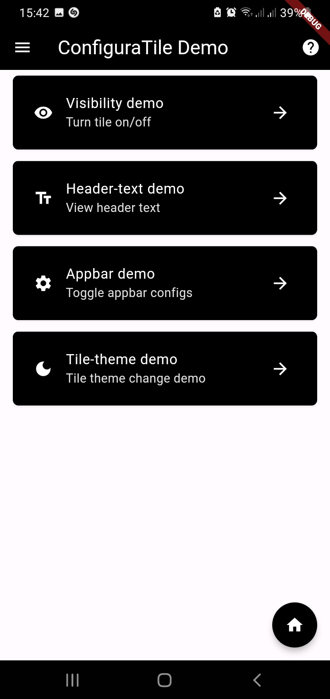

---

## Tile Configuration

ConfiguraTiles allows for extensive customization of tiles. Below is an example demonstrating various tile properties:

- Tile Visibility Demo

```dart
import 'package:flutter/material.dart';
import 'package:configura_tiles/configura_tiles.dart';

class VisibilityDemo extends StatefulWidget {
  const VisibilityDemo({Key? key}) : super(key: key);

  @override
  State<VisibilityDemo> createState() => _VisibilityDemoState();
}

class _VisibilityDemoState extends State<VisibilityDemo> {
  bool isTileVisible = true;

  @override
  Widget build(BuildContext context) {
    return ConfiguraTileForge(
      appBarConfig: ConfiguraAppBar(
        enabled: true,
        title: 'Visibility Demo',
        titleColor: Colors.white,
        backgroundColor: Colors.black,
        leadingIcon: Icons.arrow_back,
        leadingColor: Colors.white,
        onLeadingTap: () {
          Navigator.pop(context);
        },
      ),
      tiles: [
        ConfiguraTile(
          tileColor: Colors.black,
          leading: const Icon(Icons.visibility, color: Colors.white),
          title: 'Now you see me',
          subtitle: 'Now you don\'t',
          onTap: () {},
          iconColor: Colors.white,
          titleColor: Colors.white,
          subtitleColor: Colors.grey[300],
          visibilityEnabled: true,
          visibilityCondition: () => isTileVisible,
        ),
        ConfiguraTile(
          tileColor: Colors.black,
          leading: const Icon(Icons.visibility_off, color: Colors.white),
          title: 'Disappear',
          subtitle: 'Make it disappear',
          onTap: () {
            setState(() {
              isTileVisible = false;
            });
          },
          iconColor: Colors.white,
          titleColor: Colors.white,
          subtitleColor: Colors.grey[300],
        ),
        ConfiguraTile(
          tileColor: const Color.fromARGB(255, 156, 115, 115),
          leading: const Icon(Icons.remove_red_eye, color: Colors.white),
          title: 'Reappear',
          subtitle: 'Make it reappear',
          onTap: () {
            setState(() {
              isTileVisible = true;
            });
          },
          iconColor: Colors.white,
          titleColor: Colors.white,
          subtitleColor: Colors.grey[300],
        ),
      ],
      debugMode: DebugMode.userFriendly,
      customErrorMessage: 'Oops! Something went wrong.',
      fabConfig: ConfiguraFab(
        visibility: false,
        color: Colors.black,
        icon: Icons.arrow_back,
        iconColor: Colors.white,
        onFabTap: () {
          Navigator.pop(context);
        },
        snackbarColor: Colors.red,
        snackbarTextColor: Colors.white,
      ),
    );
  }
}

```

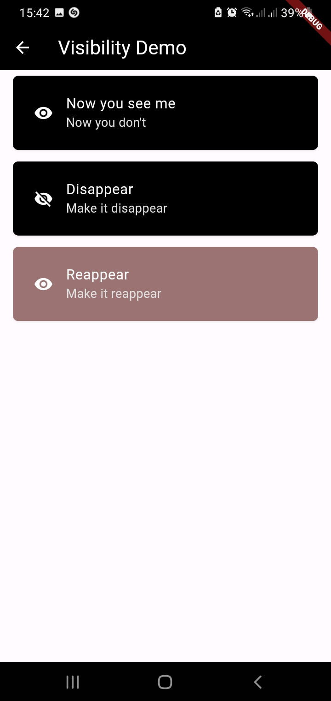

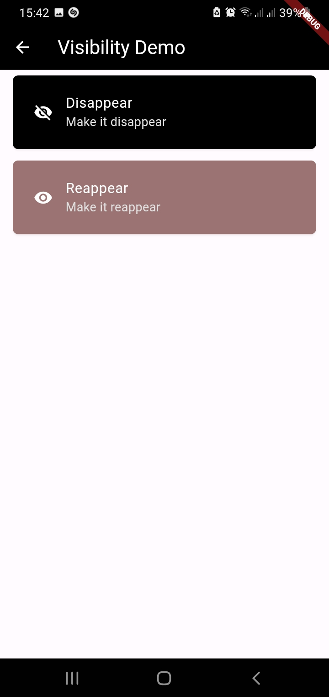

- Tile with header text

```dart
import 'package:flutter/material.dart';
import 'package:configura_tiles/configura_tiles.dart';

class TileHeaderDemo extends StatefulWidget {
  const TileHeaderDemo({Key? key}) : super(key: key);

  @override
  State<TileHeaderDemo> createState() => _TileHeaderDemoState();
}

class _TileHeaderDemoState extends State<TileHeaderDemo> {
  @override
  Widget build(BuildContext context) {
    return ConfiguraTileForge(
      appBarConfig: ConfiguraAppBar(
        enabled: true,
        title: 'Tile Header Demo',
        titleColor: Colors.white,
        backgroundColor: Colors.black,
        leadingIcon: Icons.arrow_back,
        leadingColor: Colors.white,
        onLeadingTap: () {
          Navigator.pop(context);
        },
      ),
      tiles: [
        ConfiguraTile(
          headerText: 'Header inside example',
          textAlignment: CrossAxisAlignment.start,
          headerSpacing: 10.0,
          tileColor: Colors.black,
          leading: const Icon(Icons.text_fields, color: Colors.white),
          title: 'Header Inside demo',
          subtitle: 'Example of header text inside',
          onTap: () {},
          iconColor: Colors.white,
          titleColor: Colors.white,
          subtitleColor: Colors.grey[300],
          headerTextColor: Colors.white, // Set the header text color
          headerPositionOutside: false, // Position header inside
          visibilityCondition: () => true, // Optional condition
        ),
        ConfiguraTile(
          headerText: 'Header example outside',
          textAlignment: CrossAxisAlignment.start,
          headerSpacing: 10.0,
          tileColor: Colors.black,
          leading: const Icon(Icons.text_fields, color: Colors.white),
          title: 'Header example outside',
          subtitle: 'Example of header text outside',
          onTap: () {},
          iconColor: Colors.white,
          titleColor: Colors.white,
          subtitleColor: Colors.grey[300],
          headerTextColor: Colors.black, // Set the header text color
          headerPositionOutside: true, // Position header outside
          visibilityCondition: () => true, // Optional condition
        ),
      ],
      debugMode: DebugMode.userFriendly,
      customErrorMessage: 'Oops! Something went wrong.',
      fabConfig: ConfiguraFab(
        visibility: false,
      ),
    );
  }
}

```

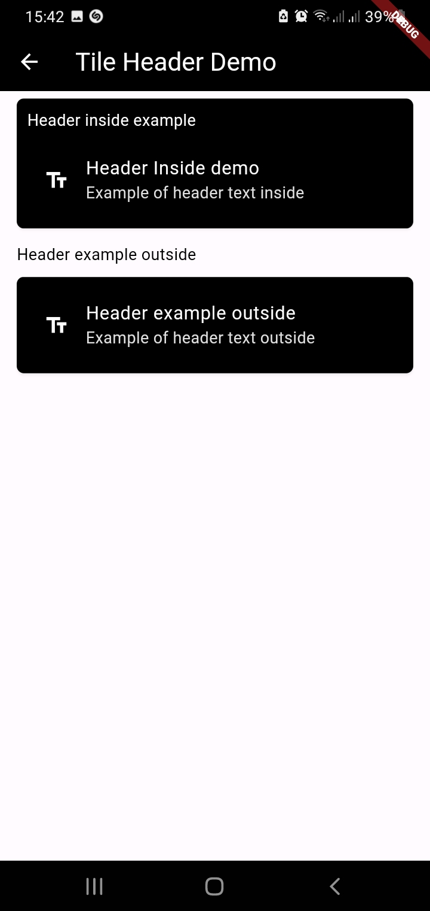

- Tile-theme demo

```dart
import 'package:flutter/material.dart';
import 'package:configura_tiles/configura_tiles.dart';

class ThemeDemo extends StatefulWidget {
  const ThemeDemo({Key? key}) : super(key: key);

  @override
  State<ThemeDemo> createState() => _ThemeDemoState();
}

class _ThemeDemoState extends State<ThemeDemo> {
  bool _isDarkMode = false;

  void _toggleTheme(bool isDark) {
    setState(() {
      _isDarkMode = isDark;
    });
  }

  @override
  Widget build(BuildContext context) {
    return ConfiguraTileForge(
      appBarConfig: ConfiguraAppBar(
        enabled: true,
        title: 'Theme Demo',
        titleColor: _isDarkMode ? Colors.white : Colors.black,
        backgroundColor: _isDarkMode ? Colors.black : Colors.white,
        leadingIcon: Icons.arrow_back,
        leadingColor: _isDarkMode ? Colors.white : Colors.black,
        onLeadingTap: () {
          Navigator.pop(context);
        },
      ),
      tiles: [
        ConfiguraTile(
          tileColor: _isDarkMode ? Colors.black : Colors.white,
          leading: const Icon(Icons.brightness_6, color: Colors.white),
          title: 'Focus on me',
          subtitle: 'To see if I change color',
          onTap: () {},
          iconColor: _isDarkMode ? Colors.white : Colors.black,
          titleColor: _isDarkMode ? Colors.white : Colors.black,
          subtitleColor: _isDarkMode ? Colors.grey[300] : Colors.grey[700],
          visibilityEnabled: true,
          visibilityCondition: () => true, // Optional condition
          themeEnabled: true,
          tileColorDark: Colors.black,
          titleColorDark: Colors.white,
          subtitleColorDark: Colors.grey[300],
        ),
        ConfiguraTile(
          tileColor: Colors.white,
          leading: const Icon(Icons.wb_sunny),
          title: 'Light Theme',
          subtitle: 'Switch to light theme',
          onTap: () {
            _toggleTheme(false);
          },
          iconColor: Colors.black,
          titleColor: Colors.black,
          subtitleColor: const Color.fromARGB(255, 68, 68, 68),
        ),
        ConfiguraTile(
          tileColor: Colors.black,
          leading: const Icon(Icons.nights_stay, color: Colors.white),
          title: 'Dark Theme',
          subtitle: 'Switch to dark theme',
          onTap: () {
            _toggleTheme(true);
          },
          iconColor: Colors.white,
          titleColor: Colors.white,
          subtitleColor: Colors.grey[300],
        ),
      ],
      debugMode: DebugMode.userFriendly,
      customErrorMessage: 'Oops! Something went wrong.',
      fabConfig: ConfiguraFab(
        visibility: false,
      ),
    );
  }
}

```

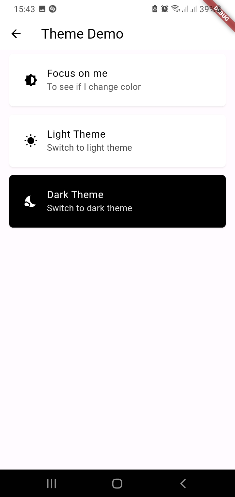

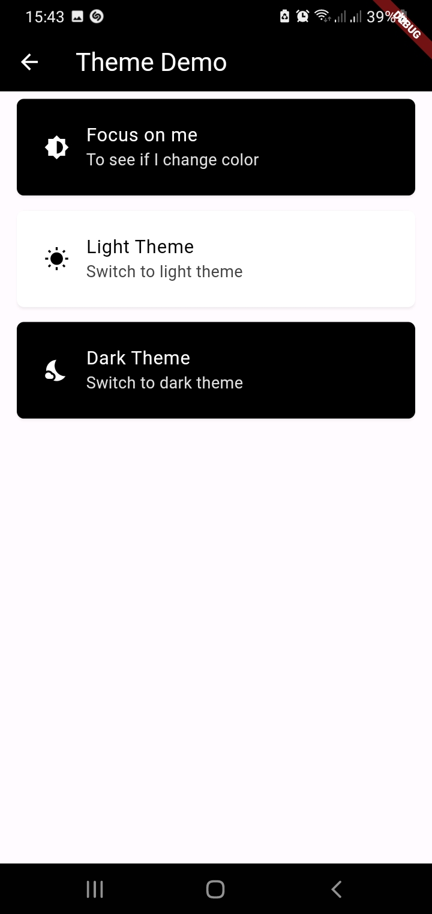

---

## App Bar Configuration

You can customize the app bar using the `ConfiguraAppBar` class. Here's are examples of some  usages:

- App Bar

```dart
ConfiguraAppBar(
        enabled: _appBarEnabled,
        title: 'App Bar Demo',
        titleColor: Colors.white,
        backgroundColor: Colors.black,
        leadingIcon: _implyLeading ? Icons.menu : null,
        leadingColor: Colors.white,
        onLeadingTap:
            _implyLeading ? () => _showCustomFunctionality(context) : null,
        trailingIcon: _trailingEnabled ? Icons.more_vert : null,
        trailingIconColor: Colors.white,
        trailingIconEnabled: _trailingEnabled,
        onTrailingTap: () {
          showDialog(
            context: context,
            builder: (BuildContext context) {
              return AlertDialog(
                backgroundColor: Colors.black,
                title: const Text(
                  'Test Successful',
                  style: TextStyle(color: Colors.white),
                ),
                actions: [
                  TextButton(
                    onPressed: () {
                      Navigator.of(context).pop();
                    },
                    child: const Text(
                      'Close',
                      style: TextStyle(color: Colors.white),
                    ),
                  ),
                ],
              );
            },
          );
        },
      ),
```

Insert screenshot of the app bar demo here:

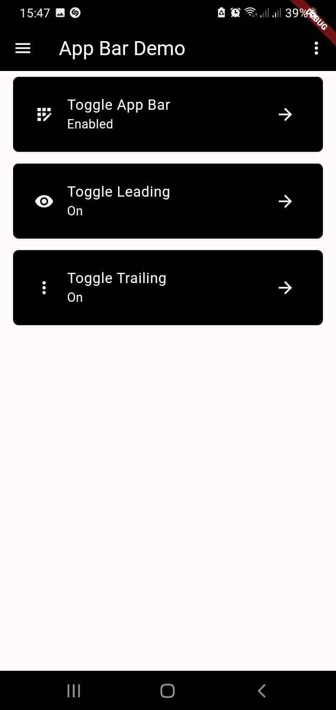

- Toggle App bar Demo

```dart
ConfiguraTile(
          tileColor: Colors.black,
          leading: const Icon(
            Icons.app_registration,
          ),
          title: 'Toggle App Bar',
          subtitle: _appBarEnabled ? 'Enabled' : 'Disabled',
          onTap: _toggleAppBar,
          iconColor: Colors.white,
          titleColor: Colors.white,
          subtitleColor: Colors.white,
          trailing: const Icon(
            Icons.arrow_forward,
          ),
          trailingColor: Colors.white,
        ),
```

Insert screenshot of the app bar demo here:

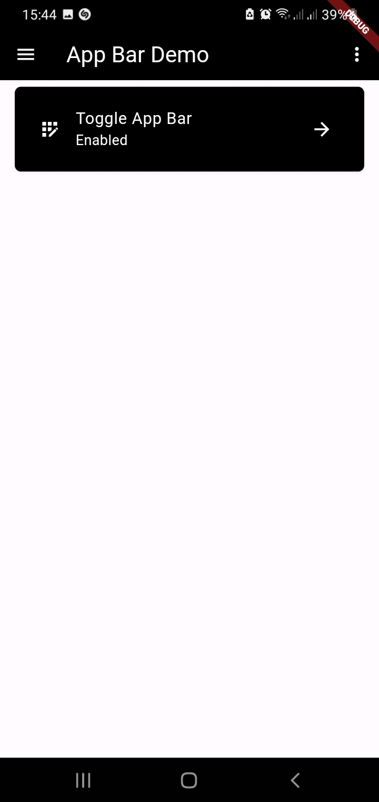

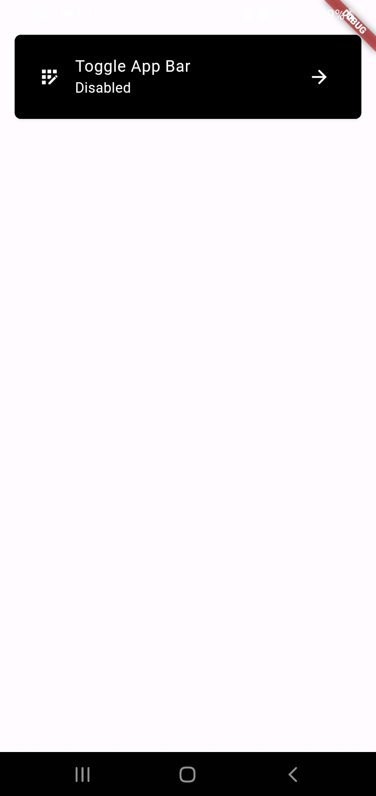

- Toggle leading icon example

```dart
ConfiguraTile(
          tileColor: Colors.black,
          leading: Icon(
            _implyLeading ? Icons.visibility : Icons.visibility_off,
            color: Colors.white,
          ),
          title: 'Toggle Leading',
          subtitle: _implyLeading ? 'On' : 'Off',
          onTap: _toggleImplyLeading,
          iconColor: Colors.white,
          titleColor: Colors.white,
          subtitleColor: Colors.white,
          trailing: const Icon(
            Icons.arrow_forward,
          ),
          trailingColor: Colors.white,
        ),
```


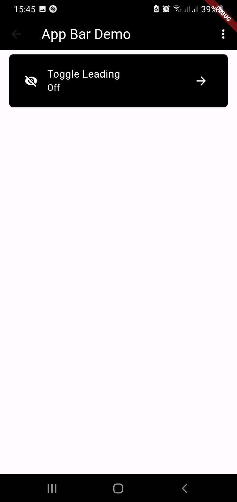

- Toggle trailing icon example

```dart
 ConfiguraTile(
          tileColor: Colors.black,
          leading: Icon(
            _trailingEnabled ? Icons.more_vert : Icons.close,
            color: Colors.white,
          ),
          title: 'Toggle Trailing',
          subtitle: _trailingEnabled ? 'On' : 'Off',
          onTap: _toggleTrailing,
          iconColor: Colors.white,
          titleColor: Colors.white,
          subtitleColor: Colors.white,
          trailing: const Icon(
            Icons.arrow_forward,
          ),
          trailingColor: Colors.white,
        ),
```

Insert screenshot of the app bar demo here:

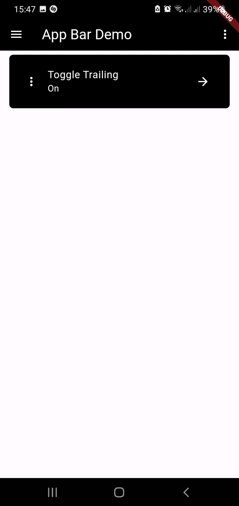

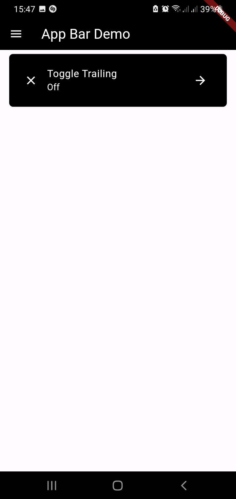

- Complete App bar example

```dart
import 'package:flutter/material.dart';
import 'package:configura_tiles/configura_tiles.dart';

class AppbarDemo extends StatefulWidget {
  const AppbarDemo({Key? key}) : super(key: key);

  @override
  State<AppbarDemo> createState() => _AppbarDemoState();
}

class _AppbarDemoState extends State<AppbarDemo> {
  bool _appBarEnabled = true;
  bool _implyLeading = true;
  bool _trailingEnabled = true;

  void _toggleAppBar() {
    setState(() {
      _appBarEnabled = !_appBarEnabled;
    });
  }

  void _toggleImplyLeading() {
    setState(() {
      _implyLeading = !_implyLeading;
    });
  }

  void _toggleTrailing() {
    setState(() {
      _trailingEnabled = !_trailingEnabled;
    });
  }

  void _showCustomFunctionality(BuildContext context) {
    showDialog(
      context: context,
      builder: (BuildContext context) {
        return AlertDialog(
          backgroundColor: Colors.black,
          title: const Text(
            'Custom Functionality',
            style: TextStyle(color: Colors.white),
          ),
          actions: [
            TextButton(
              onPressed: () {
                Navigator.of(context).pop();
              },
              child: const Text(
                'Close',
                style: TextStyle(color: Colors.white),
              ),
            ),
          ],
        );
      },
    );
  }

  @override
  Widget build(BuildContext context) {
    return ConfiguraTileForge(
      appBarConfig: ConfiguraAppBar(
        enabled: _appBarEnabled,
        title: 'App Bar Demo',
        titleColor: Colors.white,
        backgroundColor: Colors.black,
        leadingIcon: _implyLeading ? Icons.menu : null,
        leadingColor: Colors.white,
        onLeadingTap:
            _implyLeading ? () => _showCustomFunctionality(context) : null,
        trailingIcon: _trailingEnabled ? Icons.more_vert : null,
        trailingIconColor: Colors.white,
        trailingIconEnabled: _trailingEnabled,
        onTrailingTap: () {
          showDialog(
            context: context,
            builder: (BuildContext context) {
              return AlertDialog(
                backgroundColor: Colors.black,
                title: const Text(
                  'Test Successful',
                  style: TextStyle(color: Colors.white),
                ),
                actions: [
                  TextButton(
                    onPressed: () {
                      Navigator.of(context).pop();
                    },
                    child: const Text(
                      'Close',
                      style: TextStyle(color: Colors.white),
                    ),
                  ),
                ],
              );
            },
          );
        },
      ),
      tiles: [
        ConfiguraTile(
          tileColor: Colors.black,
          leading: const Icon(
            Icons.app_registration,
          ),
          title: 'Toggle App Bar',
          subtitle: _appBarEnabled ? 'Enabled' : 'Disabled',
          onTap: _toggleAppBar,
          iconColor: Colors.white,
          titleColor: Colors.white,
          subtitleColor: Colors.white,
          trailing: const Icon(
            Icons.arrow_forward,
          ),
          trailingColor: Colors.white,
        ),
        ConfiguraTile(
          tileColor: Colors.black,
          leading: Icon(
            _implyLeading ? Icons.visibility : Icons.visibility_off,
            color: Colors.white,
          ),
          title: 'Toggle Leading',
          subtitle: _implyLeading ? 'On' : 'Off',
          onTap: _toggleImplyLeading,
          iconColor: Colors.white,
          titleColor: Colors.white,
          subtitleColor: Colors.white,
          trailing: const Icon(
            Icons.arrow_forward,
          ),
          trailingColor: Colors.white,
        ),
        ConfiguraTile(
          tileColor: Colors.black,
          leading: Icon(
            _trailingEnabled ? Icons.more_vert : Icons.close,
            color: Colors.white,
          ),
          title: 'Toggle Trailing',
          subtitle: _trailingEnabled ? 'On' : 'Off',
          onTap: _toggleTrailing,
          iconColor: Colors.white,
          titleColor: Colors.white,
          subtitleColor: Colors.white,
          trailing: const Icon(
            Icons.arrow_forward,
          ),
          trailingColor: Colors.white,
        ),
      ],
      debugMode: DebugMode.userFriendly,
      customErrorMessage: 'Oops! Something went wrong.',
    );
  }
}

```

Insert screenshot of the app bar demo here:


---

## Floating Action Button Configuration

You can configure a floating action button using the `ConfiguraFab` class. Here's an example:

```dart
      fabConfig: ConfiguraFab(
        visibility: true,
        color: Colors.black,
        icon: Icons.home,
        iconColor: Colors.white,
        onFabTap: () {
          // Add logic for FAB tap
        },
    );
```

Insert screenshot of the FAB demo here:


---

## Debug Modes

ConfiguraTiles supports different debug modes to help with development. You can set the debug mode using the `debugMode` parameter:

```dart
class DebugDemo extends StatelessWidget {
  @override
  Widget build(BuildContext context) {
    return ConfiguraTileForge(
      debugMode: DebugMode.console,
      tiles: [
        ConfiguraTile(
          leading: Icon(Icons.info),
          title: 'Console Debug Mode',
          onTap: () {
            print('Tile tapped');
          },
        ),
      ],
    );
  }
}
```

---

## Project Links and Social Media

### Project Links

- ConfiguraTiles Demo: [GitHub](https://github.com/TheSageAnomaly/configura_tiles_demo)
- Clone ConfiguraTiles Demo: `git@github.com:TheSageAnomaly/configura_tiles_demo.git`
- Demo APK: [Download APK](https://github.com/TheSageAnomaly/configura_tiles_demo/blob/main/assets/apk/ConfiguraTiles%20Demo.apk)

- ConfiguraTiles Package: [GitHub](https://github.com/TheSageAnomaly/configura_tiles)
- Clone ConfiguraTiles Package: `git@github.com:TheSageAnomaly/configura_tiles.git`

### Social Media

- GitHub: [TheSageAnomaly](https://github.com/TheSageAnomaly)
- X (formerly Twitter): [TheSageAnomaly](https://x.com/TheSageAnomaly)

Feel free to explore and contribute to the project! For any questions or support, reach out to us on our social media platforms.
